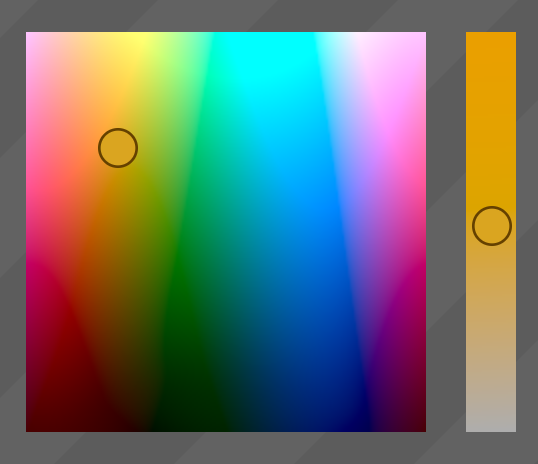

>  _alpha version — still working on introducing accessibility and form_
>  _behavior, etc_

# \<color-input\>

A custom HTML element ("web component") like `<input type="color">` but with
additional features, configurability and styling options, including support for
HCL and other color space modes.

There is a [demo page](example.html) — but be aware this will currently only work in Chrome (and maybe Safari and Opera, not sure).

<!-- MarkdownTOC autolink=true bracket=round depth=3 -->

- [Caveats](#caveats)
  - [Support](#support)
    - [Supported](#supported)
    - [Unsupported](#unsupported)
  - [About Web Components and Forms](#about-web-components-and-forms)
  - [Performance](#performance)
- [Usage](#usage)
  - [ES Module](#es-module)
  - [Common JS Module](#common-js-module)
  - [Script](#script)
- [Content Attributes](#content-attributes)
  - [The `mode` Attribute](#the-mode-attribute)
  - [The `clamp` Attribute](#the-clamp-attribute)
- [IDL Attributes](#idl-attributes)
  - [ColorInputElement.prototype.mode](#colorinputelementprototypemode)
  - [ColorInputElement.prototype.value](#colorinputelementprototypevalue)
  - [ColorInputElement.prototype.valueAsNumber](#colorinputelementprototypevalueasnumber)
  - [ColorInputElement.prototype.%%colorInterface%%](#colorinputelementprototype%25%25colorinterface%25%25)
    - [ColorInputElement.prototype.hcl](#colorinputelementprototypehcl)
    - [ColorInputElement.prototype.hsl](#colorinputelementprototypehsl)
    - [ColorInputElement.prototype.hsv](#colorinputelementprototypehsv)
    - [ColorInputElement.prototype.lab](#colorinputelementprototypelab)
    - [ColorInputElement.prototype.rgb](#colorinputelementprototypergb)
- [Events](#events)
- [CSS Properties](#css-properties)
  - [`--color-input-gutter-width`](#--color-input-gutter-width)
  - [`--color-input-high-res`](#--color-input-high-res)
  - [`--color-input-slider-radius`](#--color-input-slider-radius)
  - [`--color-input-slider-scale`](#--color-input-slider-scale)
  - [`--color-input-x-axis-direction`](#--color-input-x-axis-direction)
  - [`--color-input-y-axis-direction`](#--color-input-y-axis-direction)
  - [`--color-input-z-axis-direction`](#--color-input-z-axis-direction)
  - [`--color-input-z-axis-position`](#--color-input-z-axis-position)
  - [`--color-input-z-axis-width`](#--color-input-z-axis-width)
  - [`--color-input-xy-border`](#--color-input-xy-border)
  - [`--color-input-xy-border-radius`](#--color-input-xy-border-radius)
  - [`--color-input-xy-focus-outline`](#--color-input-xy-focus-outline)
  - [`--color-input-xy-focus-outline-offset`](#--color-input-xy-focus-outline-offset)
  - [`--color-input-z-border`](#--color-input-z-border)
  - [`--color-input-z-border-radius`](#--color-input-z-border-radius)
  - [`--color-input-z-focus-outline`](#--color-input-z-focus-outline)
  - [`--color-input-z-focus-outline-offset`](#--color-input-z-focus-outline-offset)
  - [TODO: ADDITIONAL CSS PROPERTIES FOR STYLING THE SLIDER / NUB?](#todo-additional-css-properties-for-styling-the-slider--nub)
- [ColorInputFormControlElement](#colorinputformcontrolelement)

<!-- /MarkdownTOC -->

## Caveats

### Support

This uses various DOM APIs that fall under the greater Web Component umbrella:
custom `HTMLElement` subclasses, shadow DOM, custom css properties, etc. It does
not include a polyfill or make use of a framework. Therefore it’s only suitable
for use in applications where you know these APIs are guaranteed to be
supported, which at the moment would typically mean Electron apps and Chrome
extensions, not general audience websites.

This project was mainly a way for me to familiarize myself with these upcoming
technologies and to find out what their limitations are, which is why not one
extra moment of my consideration went to the idea of agents lacking support for
some feature or another. So I don’t intend to adapt this to Polymer or any other
framework that kinda-sorta fakes web components for old browsers, but feel free
to fork it.

> *tl;dr:* for a regular website that needs to support older browsers you
> probably cannot use this until c. 2039 AD

#### Supported

- Chrome: of course
- Opera: hey now look at you dawg

#### Unsupported

At the time I write this, Firefox is actively developing support for custom
elements and the related web component APIs, so it will likely be added to the
previous list sooner than later, and I bet they’ll do a baller job.

Safari isn’t supported, but it does basically work there. You could probably
make it viable with a few CSS hacks; mainly what fails there is CSS containment.

Edge hasn’t signalled any development being underway on web components yet, and
it goes without saying that IE doesn’t support any aspect of HTML or Ecmascript
beyond `
`, maybe `<marquee>`, and throwing errors.

### About Web Components and Forms

At the moment Chrome’s support for custom elements is pretty great. I found that
I was able to implement an interface that was surpisingly close to that of a
"first class" native element. However there remain some areas of the spec that
are still being worked out. One of these trouble spots concerns elements that
should have the semantics of an `HTMLFormControl` — that is, elements which will
be "seen" by `HTMLFormElement`, `FormData`, etc.

These have in common the usage of an internal, non-ES-layer collection of the
"associated elements" of a form. One could implement support through monkey
patching certain classes and creative use of `Proxy` to some extent, but in
addition to being a bit impractical (there is really a lot of subtle stuff you’d
need to cover, including absurdities like `document.all`, if you really wanted
to be thorough), however you would still be locked out of at least one thing:
form submission (when not effected programmatically). Rather important!

While this element, like any input, can be used without a form, to support this
common need I’ve included a second element, `<color-input-form-control>`. The
reason I didn’t bake it in as an all-in-one is that I wanted to keep the core
element as "ideal" as possible; the helper element is, by necessity, a bit of a
hack and cannot properly leverage the shadow DOM for encapsulation. In the
future, when the API for declaring custom elements as form controls is defined
and implemented, I’ll be able to remove this helper.

### Performance

Computing HCL and LAB colors is a lot more expensive than computing RGB, HSL and
HSV. This only really matters when the user is dragging the z-slider, since that
implies continuous redraws of the x/y plane (in contrast, redrawing the z-axis
is always cheap, since we only need to calculate a single row of pixels). On a
fairly good comp at default sizes, the input has no trouble rendering HCL and
LAB at 60FPS (i.e., it takes less than 16ms), but at larger sizes, in high res
mode, or on a less powerful machine, the xy plane framerate may drop.

To address this in the future I might try to do a little WASMing — seems to fit
the spirit of this "latest DOM tech" exploration project.

## Usage

There are several artifacts to choose from. The first two options give you finer
control, but regardless of which you use, once the element is registered you can
use it like any other HTML element.

### ES Module

If importing the module from another ES module, the exports are
`ColorInputElement` (the element constructor itself) and `register`, a
convenience function that will register the custom element for you. The
`register` function takes, optionally, a name string, if you want to call it
something other than 'color-input'.

This is just `src/index.js`; it is listed in the `module` field in package.json
so tools like Rollup will pick it up automatically.

### Common JS Module

When using with `require()` and CJS modules, you’ll instead get
`dist/index.cjs.js`, which has the same exports but as CJS module properties.

### Script

You can also load `dist/index.iife.js` or `dist/index.iife.min.js` with a
script element. In this case, there’s nothing to export; registration will be
automatic.

## Content Attributes

Most of the content attributes (aka html attributes) mirror those of `<input>`
where applicable:

- `disabled`
- `name`
- `readonly`
- `required`
- `value`
- ...plus any other generic attributes

Note that `value`, as with `<input>`, describes the initial or default value.
The `value` attribute’s value may be any color value as defined by the CSS spec,
provided the browser supports it.

The `readonly` and `disabled` attributes can both be used to prevent user input;
the distinction between these (and the effect of `required`) only becomes
meaningful when used within a form (or more subtly by their effect on tabindex).

In addition there is one unique attribute, `mode`.

### The `mode` Attribute

Like most color inputs, this one uses an XY plane to describe two dimenions of
the color space and a Z slider to describe the third dimension. The mode
attribute determines which color space model to use and which axis is which.

The core modes are HCL, HSL, HSV, LAB, and RGB. However we take the order of the
three key letters to map to X and Y (the plane) and Z (the slider). Thus if you
want RGB but with red vs blue for the plane and green as the slider, the mode
you’d specify would be "rbg".

There are a total of 30 possible mode values (case insensitive).

| Base Mode | Meaning                   | Permutations                         |
|-----------|---------------------------|--------------------------------------|
| HCL       | hue chroma luminance      | hcl hlc chl clh lhc lch              |
| HSL       | hue saturation luminosity | hsl hls shl slh lhs lsh              |
| HSV       | hue saturation value      | hsv hvs shv svh vhs vsh              |
| LAB       | lightness G-R B-Y         | lab lba alb abl bla bal              |
| RGB       | red green blue            | rgb rbg grb gbr brg bgr              |

The default mode is "hlc".

### The `clamp` Attribute

This attribute takes a boolean "true" or "false" value; the default is "true".

Unlike the others modes, LAB and HCL are not normally constrained to the same
set of colors as would be found in the RGB color space. For the purposes of an
HTML color picker that ultimately models hex values, they need to be. That is to
say, these color spaces can describe colors which are imaginary within the sRGB
colorspace, which presents a challenge when it comes to projecting them in a
context that’s limited to the sRGB color space.

There are two ways I know of to deal with that: you can clamp colors to the
nearest (sort of) non-imaginary color or you can simply blank them out. By
default, we clamp them, which in the general case presents the best user
experience; outside of fairly technical contexts, users are unlikely to find it
intuitive or useful that random-seeming chunks of a color-picker are just
"empty", and the clamped presentation still gets the core benefits of HCL in
terms of being more natural for human vision. However by setting `clamp` to
false, you can instead map imaginary colors to black.

## IDL Attributes

(So to speak; there is no real IDL here, but this is the term typically used to
refer to the ES APIs of HTML elements.)

### ColorInputElement.prototype.mode

This corresponds to the [`mode` content attribute](#the-mode-attribute) and is
settable.

### ColorInputElement.prototype.value

This has the same semantics as `HTMLInputElement.prototype.value`. It retrieves
the value if there is one (always as a 7-digit RGB hex) or returns an empty
string if there is not one; if the input isn’t dirty and there is a valid
`value` content attribute, it returns the RGB hex value of that default value.

When assigning to `value`, the input becomes dirty as if a user had interacted
with it. Setting to `undefined`, `null`, or an empty string is legal, unlike the
vendor `<input type="color">` element. If the value is not recognized as a color
(it can be any CSS color) it will not throw, but it will set the value to the
empty string.

Setting `value` programmatically will cause the "selection" to update, i.e. the
GUI will re-render and the selection nubs will move.

### ColorInputElement.prototype.valueAsNumber

As with `<input>` this accessor permits reading and writing the value as a
single number; though coercive, unlike `value` it will potentially throw a
`TypeError` or `RangeError`. When assigning, the value must be an integer in the
range `0x0` to `0xFFFFFF`.

For example:

    colorInputElement.value = 'green';
    colorInputElement.value;                      // "#008000"
    colorInputElement.valueAsNumber;              // 32768
    colorInputElement.valueAsNumber.toString(16); // "8000"
    colorInputElement.valueAsNumber = 16764125;
    colorInputElement.value;                      // "#FFCCDD"

### ColorInputElement.prototype.%%colorInterface%%

For each supported mode, there is a proxy object that exposes the component
parts as readable and assignable properties. It doesn’t matter which mode you’re
actually in; these are always available.

#### ColorInputElement.prototype.hcl

- `ColorInputElement.prototype.hcl.h`: 0 to 360 (hue\*)
- `ColorInputElement.prototype.hcl.c`: 0 to 134 (chroma)
- `ColorInputElement.prototype.hcl.l`: 0 to 100 (luminance)

#### ColorInputElement.prototype.hsl

- `ColorInputElement.prototype.hsl.h`: 0 to 360 (hue)
- `ColorInputElement.prototype.hsl.s`: 0 to 100 (saturation)
- `ColorInputElement.prototype.hsl.l`: 0 to 100 (luminosity)

#### ColorInputElement.prototype.hsv

- `ColorInputElement.prototype.hsv.h`: 0 to 360 (hue)
- `ColorInputElement.prototype.hsv.s`: 0 to 100 (saturation)
- `ColorInputElement.prototype.hsv.v`: 0 to 100 (value)

#### ColorInputElement.prototype.lab

- `ColorInputElement.prototype.lab.l`: 0 to 100 (lightness)
- `ColorInputElement.prototype.lab.a`: -110 to 110 (green-red)
- `ColorInputElement.prototype.lab.b`: -110 to 110 (blue-yellow)

#### ColorInputElement.prototype.rgb

- `ColorInputElement.prototype.rgb.r`: 0 to 255 (red)
- `ColorInputElement.prototype.rgb.g`: 0 to 255 (green)
- `ColorInputElement.prototype.rgb.b`: 0 to 255 (blue)

> \* Note that the 'hue' of HCL is not equivalent to the 'hue' of HSL and HSV.

## Events

Only one event is fired, 'change', when the value changes. You can access the
new value as `event.target.value`.

## CSS Properties

There are a number of CSS properties that allow you to customize the
presentation of the element. Some simply proxy familiar properties down to
elements in the shadow DOM while others have original semantics.

Naturally the element itself can be styled (width, height, etc) like any other.
The default height and width values are 230px and 275px. This is inclusive of
the interior padding which derives from the slider radius, because the slider
requires room around the edges of the panel. When this padding is factored in,
the aggregate effect with all defaults is a 200×200 xy plane and a 25×200
z-axis.

### `--color-input-gutter-width`

This sets the thickness of the gutter between the XY plane and the Z slider, if
any. By default this is 20px. Any size (px, em, percentage, etc) is fine, but
keep in mind accounting for the sliders.

### `--color-input-high-res`

There are three possible values, `true`, `false` and `auto`. In `auto`
mode, the resolution of the output is determined by the device pixel ratio of
the client.

The default is `false` (not `auto`) because in general you’re not very likely to
want this on: because the visuals are all smooth gradations of color, the extra
resolution does not contribute much to what the output looks like. Meanwhile the
cost of high res is quite high, since it multiplies the number of pixels values
to calculate by four. Especially in HCL and LAB modes, which are more
computationally expensive, I would not recommend enabling this unless the color
input is quite small to begin with.

### `--color-input-slider-radius`

This value determines the max size of the sliders — and consequently it also
determines how much padding lives around the color panels. It defaults to 15px.

### `--color-input-slider-scale`

This value must be a floating point number (and should probably be between 0 and
1). When in a neutral state, the slider nubs will be scaled by this factor; the
full radius is only used when the user is actively dragging. You can disable
that effect by setting this value to `1`. The default is `0.667`.

### `--color-input-x-axis-direction`
### `--color-input-y-axis-direction`
### `--color-input-z-axis-direction`

Each of these may be "ascending" (default) or "descending". Ascending means the
value increases as it moves from left to right or from bottom to top.

### `--color-input-z-axis-position`

Valid values are "start", "end", "left", "right", "top" or "bottom". The default
is "end".

The "start" and "end" values indicate a horizontal orientation where the z-axis
is vertical, like "left" and "right"; however, unlike "left" and "right" it is
sensitive to text direction. For example "end" behaves like "right" in a Latin
document and "left" in an Arabic document.

### `--color-input-z-axis-width`

Like `--color-input-gutter-width`, this can be any length value. It describes
the thickness of the z-axis (regardless of whether the slider is horizontal or
vertical) relative to the total area, and therefore by extension it also
influences the size of the xy plane. By default it’s 35px. Note that the gutter,
if present, "cuts into" both the plane and the slider; thus a
`--color-input-z-axis-width` of 50%, if there is a 10px gutter, means the actual
area given to the z-axis would end up being 50% less 5px, such that the plane
and slider would end up equal in size as one would expect for such a value.

### `--color-input-xy-border`
### `--color-input-xy-border-radius`
### `--color-input-xy-focus-outline`
### `--color-input-xy-focus-outline-offset`
### `--color-input-z-border`
### `--color-input-z-border-radius`
### `--color-input-z-focus-outline`
### `--color-input-z-focus-outline-offset`

These four properties are simply passed down to the content elements. They
accept the same values as you’d give to `border` etc.

> There is no way to define pseudo element or pseudo class selectors for shadow
> DOM elements presently; if there were, it’d be a better fit than just choosing
> a subset of properties in this manner. For one, it’s not realistic to proxy
> every possible rule down like this, but more importantly, even if we did, the
> ordinary cascade rules won’t entirely apply; for example, we cannot support
> "border-left" because there’s no mechanism for us to introspect what order
> custom properties were defined in.

### TODO: ADDITIONAL CSS PROPERTIES FOR STYLING THE SLIDER / NUB?

## ColorInputFormControlElement

This helper element (explained a bit [above](#about-web-components-and-forms))
can be used to make a ColorInput behave like a form component. The actual
element should be its child:

    <form>
      <color-input-form-control>
        <color-input name="foo"></color-input>
      </color-input-form-control>
    </form>

In order to achieve this behavior, this element needs to place a regular vendor
`<input>` element (hidden) in the light DOM, so it’s not properly encapsulated
or protected from global CSS. It will manage sync between the ColorInputElement
and the hidden HTMLInputElement, which is what the form itself will then pick up
on.
